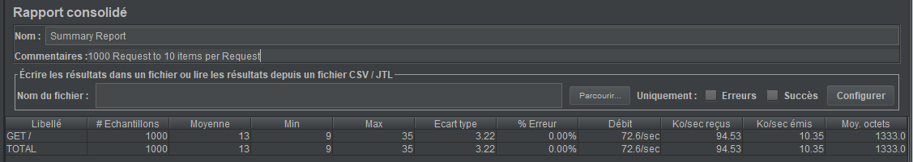
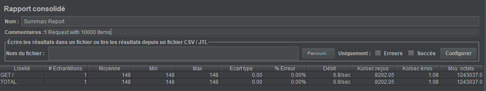

# Teaching-HEIGVD-AMT-2019-Project-Two

## Rapport

##### Auteurs

Baptiste Hardrick\
Miguel Gouveia

## User API

La première API est utilisée pour gérer des comptes utilisateur.\
Chaque compte a un e-mail, un nom, prenom, mot-de-passe et un booléen déterminant s'il est admin ou non.\
Un utilisateur peut changer son mot-de-passe mais pas celui d'un autre. Seul un admin le peut.\
Un administrateur peut voir tous les comptes, un utilisateur ne peut voir que le sien.\
Nous avons aussi fait en sorte que seul un compte administrateur peut créer un compte.\
Pour vérifier si un utilisateur est identifié en tant qu'administrateur ou non, il doit soumettre un token JWT reçu lorsqu'il se connecte.

### Lancer l'application
Commencer par lancer le script run-docker.sh\
Une fois ce dernier lancé, démarrer le script run-user-manager.sh\
Enfin pour lancer les tests Cucumber, lancer le script run-user-manager-test.sh\
Pour tester l'api, aller sur [localhost:8080/api-user-manager](http://localhost:8080/api-user-manager/swagger-ui.html) </br>

### Ce qui a été implémenté
Les features de l'API ont été décrit précédemment.\
Pour cette API, nous n'avons eu besoin d'implémenter qu'une entité: UserEntity. Celle-ci comprenait les spécifications propres à un utilisateur.\
Nous avons eu de la difficulté à implémenter des intercepteurs, ce pourquoi il n'y en a pas dans cette API.\
Nous avons implémenté deux classes utilitaires: un JWTHelper sous forme de service et une classe Utils. La première s'occupe de la génération
de token JWT ainsi que leur décodage. La seconde s'occupe du hash des mot-de-passes ainsi que de la vérification du hash contenu dans la base de donnée avec
le mot de passe soumis par l'utilisateur.\

### Tests
Nous avons testé tous les chemins implémentés dans l'API directement [ici](http://localhost:8080/api-user-manager/swagger-ui.html).\
Des tests plus rigoureux ont été implémentés de manière automatique avec Cucumber dans divers scénarios dans le dossier ```/auth-specs```.\
Ceux-ci ne testent pas tous les chemins possible mais seulement les principales contraintes comme celle de la création d'un utilisateur permise seulement par un compte
administrateur, le changement de mot de passe ainsi que le login.

### Résultat des tests
Tous nos tests ont passé:
\
\
Nous pouvons voir que tous les scénarios se passent comme prévu, nous pouvons ainsi être sûr que les routes testées n'ont pas de problème.

### Bugs et limitations
Aucun bug n'a été observé pour cette API.\
Il y a une limitation au niveau des tests; quand on lance la première fois, tous les tests passent, mais la seconde fios, un test ne passe pas.
Cela est du au fait que dans un des tests, on ajoute un utilisateur dans la base de donnée. Si on réessaie de l'ajouter une seconde fois, l'opération est refusée car il n'y a qu'un compte par adresse mail.

## Flight API

Nous avons repris notre flight-manager du premier labo comme seconde API. Nous avons une table Customer. Un customer est composé d'un pseudo, un prénom, un nom, un age et un mot de passe.

Nous avons une deuxième table flight. Un flight est composé d'un nom, d'un point de départ, d'un point d'arrivé, d'une date de départ, d'une date d'arrivé et d'un prix.

L'entité flight et customer se comporte de la même façont. On peut ajouter un élément, le récupérer avec son Id, le supprimer avec son Id et récupérer tous les éléments avec une pagination. Page et size en paramètre dans l'url pour choisir quels le nombre d'éléments qu'on veut récupérer.

### Lancer l'application

Commencer par lancer le script run-docker.sh\
Une fois ce dernier lancé, démarrer le script run-flight-manager.sh\
Pour tester l'api, aller sur [localhost:8081/api-flight-manager](http://localhost:8081/api-flight-manager/swagger-ui.html) </br>

### Ce qui a été implémenté

Les features de l'API ont été décrit précédemment.\
Pour cette API, nous avons eu besoin d'implémenter CustomerEntity et FlightEntity.

### Tests JMeter

Notre base de donnée a 10'000 éléments.

Nous faisons 1000 requêtes avec la taille(pramètre size) par défault (10).



Nous faisons une requête avec 10'000 comme taille pour tout récupérer d'un coup.



Nous remarquons que c'est rapide avec 1 seule requête.

## Bugs et limitations

Aucun bug n'a été observé pour ces API.\
Il y a une limitation au niveau des tests; quand on lance la première fois, tous les tests passent, mais la seconde fios, un test ne passe pas.
Cela est du au fait que dans un des tests, on ajoute un utilisateur dans la base de donnée. Si on réessaie de l'ajouter une seconde fois, l'opération est refusée car il n'y a qu'un compte par adresse mail.


## Respect des contraintes

Les contraintes ont été respectées en général, cependant nous n'avons pas implementé le container Traefik ainsi que le fait d'avoir nos back-end qui tournent sur un container.

